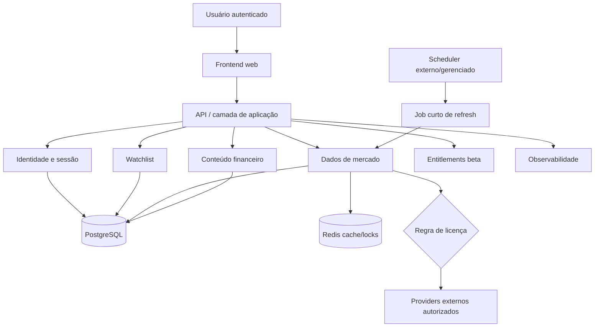

# Market Pulse — Visão de arquitetura

- **Status:** Decisões-base aceitas; integrações e infraestrutura não configuradas
- **Data:** 2026-08-30

## Por que monólito modular

O beta possui vários domínios, mas uma única equipe, prazo curto e baixa necessidade operacional inicial. Um monólito modular reduz deploys, contratos distribuídos e observabilidade entre serviços, mantendo fronteiras internas testáveis. Microserviços e serverless fragmentado aumentariam coordenação e custo antes de haver carga que os justifique.

## Classificação das tecnologias

| Componente | Classificação | Observação |
| --- | --- | --- |
| Next.js + TypeScript + Tailwind | Decisão adotada | Frontend planejado; não configurado no Dia 1 |
| FastAPI | Decisão adotada | API planejada; não configurada no Dia 1 |
| SQLAlchemy 2 + Alembic | Decisão adotada | Persistência/migração planejadas |
| PostgreSQL | Decisão adotada | Fonte persistente; serviço não criado |
| Redis | Decisão adotada | Cache/lock não autoritativo; serviço não criado |
| OpenAPI | Decisão adotada | Contrato web/API |
| Scheduler externo/gerenciado | Decisão em princípio | Plataforma e frequência pendentes |
| Vercel | Destino pretendido | Frontend; nenhuma conta/projeto criado |
| Neon, Upstash | Opções consideradas | Nenhum serviço provisionado |

## Módulos de domínio

- **Identidade e sessão:** usuários, credenciais, sessões e autorização.
- **Watchlist:** lista única do beta e itens por usuário.
- **Dados de mercado:** catálogo, adapters, normalização, snapshots, freshness e fallback.
- **Conteúdo financeiro:** blocos, Morning Call, validação, revisão e publicação.
- **Entitlements:** acesso beta único; billing e planos pagos fora do MVP.
- **Observabilidade:** health, ingestion runs, logs e métricas mínimas.

Fronteiras que exigem ADR para mudança: payload nativo fora do adapter; Redis como fonte única; UI lendo banco/provider; conteúdo publicável sem política; licença como lembrete manual; schema HTTP usado como modelo persistente.

## Diagrama

## Fluxo de dados de mercado

1. Scheduler futuro aciona comando/job idempotente.
2. Aplicação obtém lock no Redis.
3. Regra de licença avalia provider, dataset e público.
4. Adapter autorizado busca com timeout e retries limitados.
5. Normalizador converte símbolo, moeda, valores e timestamps.
6. Validador rejeita números impossíveis, tempo incoerente e payload inválido.
7. Repositório grava snapshot válido e ingestion run no PostgreSQL.
8. Cache recebe representação normalizada.
9. API responde com proveniência, `data_level` e freshness.
10. Falha usa último snapshot validado por ativo e o marca stale.

## Erros, segredos e tempo

Adapters convertem falhas externas em categorias internas: timeout, rate limit, indisponível e payload inválido. A API usa Problem Details sem body bruto, credencial, stack trace ou string de conexão. Logs usam IDs de correlação e nunca tokens ou cookies.

Timestamps são armazenados em UTC e exibidos com zona explícita. `REAL_TIME`, `DELAYED`, `EOD` e `DEMO` descrevem o nível do feed. Freshness é independente: um feed delayed pode estar fresh para sua janela, enquanto um dado real-time antigo está stale.

## Extração e dependências futuras

Somente com evidência poderão ser extraídos ingestão/job, conteúdo editorial ou observabilidade. Market data, PostgreSQL/Redis gerenciados, scheduler e observabilidade podem exigir licença ou plano pago; nada será contratado sem decisão explícita.

## Alternativas consideradas

| Alternativa | Vantagens | Desvantagens | Custo operacional | Impacto no beta |
| --- | --- | --- | --- | --- |
| Monólito modular | Um backend e fronteiras internas | Exige disciplina modular | Baixo | Recomendado |
| Microserviços | Escala independente | Rede, deploy, tracing e dados distribuídos | Alto | Atrasaria o beta |
| Serverless fragmentado | Escala por função | Limites, cold starts e contratos dispersos | Médio/alto | Complexidade prematura |
