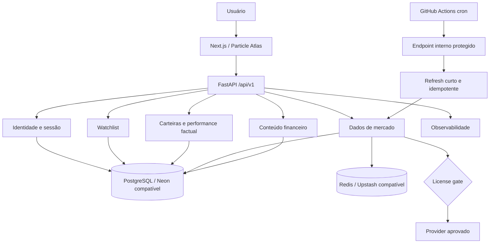

# Market Pulse — arquitetura canônica do MVP beta

- **Status:** Decisões-base aceitas; infraestrutura externa não provisionada
- **Data:** 2026-08-30
- **Horizonte:** beta de 30 dias

## Direção arquitetural

O Market Pulse usa monorepo e monólito modular porque há uma pessoa, prazo curto e um fluxo principal. Fronteiras internas claras preservam testabilidade e extração futura sem assumir o custo de microserviços, filas ou operação distribuída antes de existir necessidade comprovada.

## Stack e destinos aprovados

| Camada | Decisão do MVP | Estado no Dia 1 |
| --- | --- | --- |
| Web | Next.js App Router, React, TypeScript strict e Tailwind CSS | Shell inicial e cliente OpenAPI gerado; UX P0 ainda pendente |
| API | FastAPI e Python | Contratos, health, providers candidatos, normalização, cache e refresh interno implementados |
| Persistência | SQLAlchemy 2, Alembic e PostgreSQL | Planejado; sem banco criado |
| Cache/lock | Redis; compatibilidade alvo com Upstash Redis REST | Cache-aside, stale-if-error, negative cache e lock distribuído locais |
| Contrato | OpenAPI e API versionada em `/api/v1` | Planejado |
| Job | Processo curto e idempotente usando o código da API | Orquestrador interno implementado; endpoint/agendamento público ainda pendente |
| Agendamento | GitHub Actions cron chamando endpoint interno protegido | Planejado; sem workflow de produção ou segredo |
| Frontend externo | Vercel | Destino pretendido; sem login/projeto/deploy |
| API externa | Render | Destino pretendido; sem login/serviço/deploy |
| Banco externo | Neon PostgreSQL | Destino pretendido; sem conta/projeto |
| Redis externo | Upstash Redis REST | Destino pretendido; sem conta/projeto |
| Desenvolvimento | Docker Compose local para API/PostgreSQL/Redis e ferramentas | Planejado; não criado |

Esses destinos refinam a arquitetura sem autorizar contratação, provisionamento ou publicação. Troca material de stack, fonte de verdade, mecanismo de sessão ou fronteira de domínio exige justificativa e, quando aplicável, ADR.

## Módulos do monólito

- **Identidade e sessão:** usuários, credenciais Argon2id, sessões opacas e autorização.
- **Watchlist:** lista do usuário e seus itens, sempre isolados por identidade.
- **Carteiras informativas:** carteiras próprias, ledger append-only de eventos manuais, posições, patrimônio e performance factual; nunca gestão ou recomendação.
- **Dados de mercado:** catálogo, adapters, normalização, snapshots, freshness e fallback.
- **Universo de ativos:** ações selecionadas, ETFs e FIIs somente com fonte aprovada; fundos tradicionais permanecem P1 e bloqueados sem licença, cobertura e autorização documental.
- **Conteúdo financeiro:** blocos tipados, Morning Call, validação, revisão e publicação append-only.
- **Entitlements:** acesso beta e eventual isolamento do Stripe em modo de teste; cobrança real fora do MVP.
- **Observabilidade:** health, `ingestion_runs`, correlação, logs e métricas mínimas.

Modelos de provider, domínio, persistência e resposta HTTP não são intercambiáveis. O frontend consome somente a API; não lê provider, PostgreSQL ou Redis diretamente.

## Visão de componentes

## Fluxo de dados de mercado

1. O scheduler chama endpoint interno autenticado; chamadas não autorizadas falham fechadas.
2. O job obtém lock com TTL e registra a tentativa.
3. O license gate avalia provider, plano, endpoint, dataset, finalidade e modalidade.
4. Apenas combinação `PUBLIC_APPROVED` pode alimentar exposição pública.
5. O adapter busca com timeout e retry limitado, sem propagar payload nativo.
6. O normalizador converte símbolo, bolsa, moeda, números e timestamps.
7. O validador rejeita valor impossível, tempo incoerente ou payload incompleto.
8. PostgreSQL grava snapshot válido e `ingestion_run`; Redis recebe cache derivado.
9. A API responde com fonte, timestamps, `DataLevel`, `Freshness` e limitações.
10. Em falha, usa cache/snapshot previamente validado como `STALE`; sem candidato válido, retorna `UNAVAILABLE`.

PostgreSQL é a fonte persistente. Redis nunca é a única cópia autoritativa e perda de cache não pode implicar perda de dado válido.

## Dados, tempo e contrato

`DataLevel` descreve modalidade contratual (`REAL_TIME`, `DELAYED`, `EOD`, `DEMO`). `Freshness` descreve estado operacional (`FRESH`, `STALE`, `UNAVAILABLE`). São independentes e viajam no contrato com `source`, `source_timestamp`, `fetched_at`, atraso conhecido, motivo de stale e limitação.

Timestamps são armazenados em UTC e apresentados com zona explícita. `REAL_TIME` exige comprovação contratual e técnica. Fallback nunca inventa nem promove dado antigo a atual.

A API usa Problem Details para erros, IDs de correlação e OpenAPI como contrato web/API. Respostas e logs não incluem credenciais, cookies, strings de conexão, stack traces ou body bruto de terceiros.

## Sessão e segurança

- Senhas são derivadas com Argon2id e parâmetros versionados.
- Sessão usa identificador opaco aleatório; somente hash/estado necessário fica persistido.
- Cookie é `HttpOnly`, `Secure` em produção e `SameSite=Lax` por padrão.
- Requisições mutáveis validam Origin/CSRF conforme o fluxo escolhido.
- Logout, expiração e revogação invalidam a sessão no servidor.
- Endpoint de refresh possui segredo próprio, rotação possível, rate limit e falha fechada.
- CORS usa allowlist explícita; logs aplicam minimização e redação.

## Particle Atlas e Global Atlas

Particle Atlas é a camada visual e de interação, não fonte de dados nem motor analítico. O P0 inclui tema escuro técnico monocromático, tokens, componentes reutilizáveis, layout responsivo, estados de loading/vazio/erro/stale/unavailable, dashboard, busca/página de ativo, watchlist, carteiras informativas, Morning Call, heatmap básico e Global Atlas em tabela acessível.

Toda visualização mantém fonte, horário, latência, `DataLevel`, `Freshness`, limitações e disclaimer. Preto/branco/cinza predominam; verde/vermelho/azul têm semântica UP/DOWN/FLAT e âmbar/violeta/cinza identificam estados restritos com rótulo ou ícone redundante; nenhuma decisão depende apenas da cor.

Gráficos de uma série exibem uma linha real e o valor bruto. Comparações de duas ou mais séries exibem linhas reais correspondentes e usam `INDEX_100` por padrão, mantendo `actual_value`, moeda, variação e base temporal acessíveis. Preço bruto só é habilitado com compatibilidade de moeda, unidade, calendário e metodologia ou FX aprovado.

Partículas, ondas, Canvas/WebGL, profundidade, transições avançadas e globo 3D leve são P1 condicionais. Devem usar feature flag, respeitar `prefers-reduced-motion`, possuir fallback sem perda informacional e não bloquear carregamento, teclado ou o beta.

## Operação e degradação segura

Render e outros serviços compatíveis podem ter cold start. Healthchecks devem distinguir processo vivo, dependências e prontidão; o frontend apresenta atraso/indisponibilidade sem sugerir dado atual. GitHub Actions cron não é garantia de pontualidade e o refresh deve aceitar atraso, repetição e concorrência.

Falhas esperadas — timeout, rate limit, provider indisponível, Redis ausente, payload inválido e banco indisponível — precisam de categorias internas, métricas e comportamento seguro. Retry é limitado e não mascara licença negada nem erro permanente.

## Restrições de implantação

O Dia 1 apenas prepara decisões e referências. Credenciais ficam fora do Git. Vercel, Render, Neon, Upstash, GitHub Actions agendado e Stripe não podem ser conectados, provisionados ou publicados sem autorização posterior. Docker Compose serve exclusivamente ao desenvolvimento local.

## Alternativas rejeitadas para o beta

| Alternativa | Motivo de não adoção agora |
| --- | --- |
| Microserviços | Aumentam contratos, deploys, rede e observabilidade sem necessidade comprovada |
| Backend fragmentado em funções | Amplia cold starts e dispersa transações/fronteiras |
| Daemon/worker permanente | O refresh cabe em job curto; custo operacional seria prematuro |
| Redis como fonte de verdade | Cache é volátil e não substitui persistência/auditoria |
| WebSockets/tick streaming | Licença, custo e complexidade fora do beta |
| Globo 3D obrigatório | Não melhora o fluxo P0 e cria risco de desempenho/acessibilidade |
